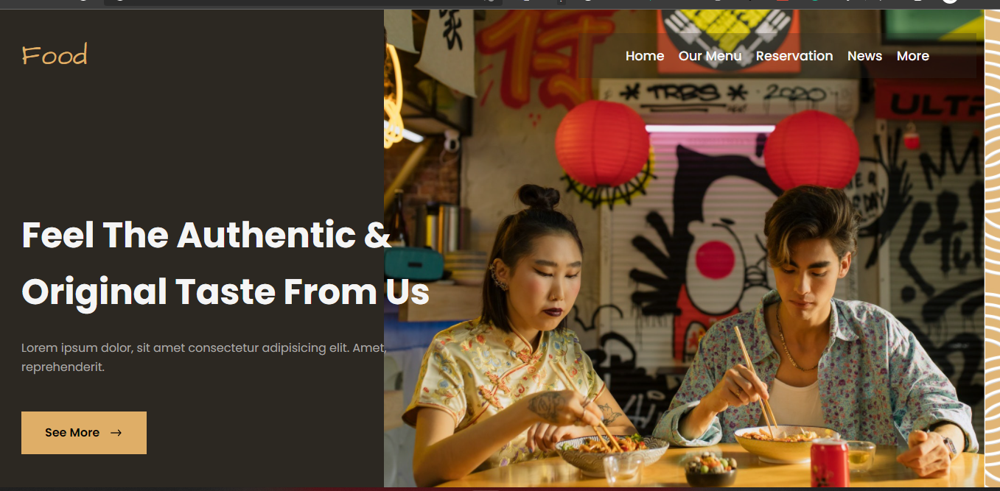

## Available Scripts

In the project directory, you can run:

### `yarn start`

Runs the app in the development mode.\
Open [http://localhost:3000](http://localhost:3000) to view it in your browser.

## Image

## Link demo netlify

[React Food](https://splendid-chebakia-6840c0.netlify.app)